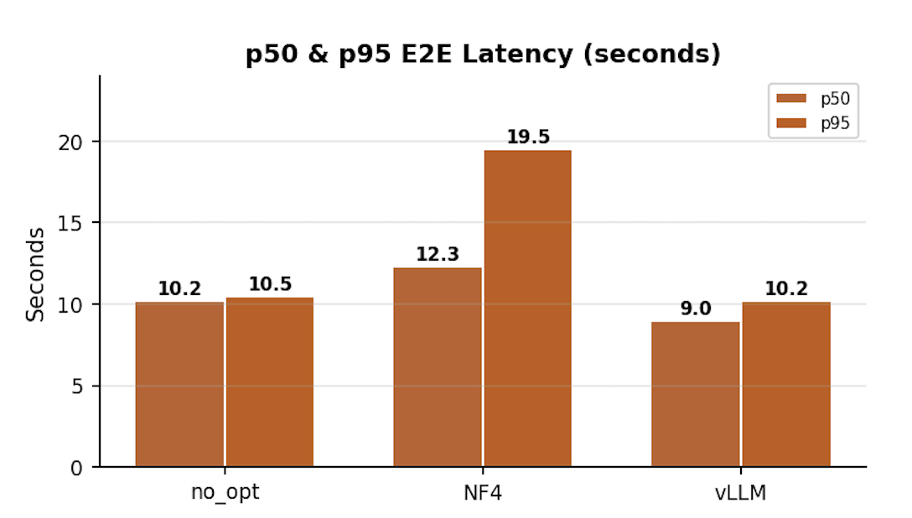

# HPML Final Project: Speculative RAG

> **Course:** High Performance Machine Learning
> **Semester:** Spring 2026
> **Instructor:** Dr. Kaoutar El Maghraoui

---

## Team Information

- **Team Name:** Speculative RAG
- **Members:**
  - Soyoon Park (sp4412) - Created and managed the W&B project and GitHub repository; built the 21M-passage dataset embedding pipeline; ran the full baseline RAG evaluation on approximately 8k samples; implemented and integrated verifier logic into the Speculative RAG pipeline; ran Speculative RAG experiments including no-opt 1k samples, NF4, and the `m={5,10,15,20}` sweep; wrote the final report abstract, introduction, discussion/limitations, and conclusion.
  - Rupeet Kaur (rk3408) - Built the full drafter pipeline from retrieval to sampling to drafting with final verifier inputs; modified the sampling pipeline for KV-cache-aware retrieval; modified the verifier pipeline to include vLLM profiling and PyTorch profiler support; integrated data fetching for Standard RAG; built Standard RAG components from generation through retrieval; built Speculative RAG tests for no optimization, NF4, INT8, vLLM, `m` sweep, and `k` sweep; produced PyTorch Profiler and Nsight Systems profiling analysis; wrote final report experiment analysis and before/after optimization/profiling analysis.
  - Hsuan-Ting Lin (hl3930) - Implemented and debugged Speculative RAG sampling logic; ran and debugged no-opt and vLLM experiments on 100-sample tests; ran 1000-sample Speculative RAG tests; prepared profiler visualizations and performance analysis for no-opt, vLLM, and Standard RAG; wrote the final report literature review and methodology sections.
  - Alexandar Vassilev (av3341) - Implemented the Standard RAG baseline pipeline and GCP/Vertex evaluation setup.

## Submission

- **GitHub repository:** [https://github.com/soyoon-cu/speculative-rag](https://github.com/soyoon-cu/speculative-rag)
- **Final report:** [`deliverables/Team14_HPML_Final_Report.pdf`](deliverables/Team14_HPML_Final_Report.pdf)
- **Final presentation:** [`deliverables/Team14_HPML_Final_Presentation.pdf`](deliverables/Team14_HPML_Final_Presentation.pdf)
- **Experiment-tracking dashboard:** [Weights & Biases project](https://wandb.ai/soyoon-columbia-university/hpml-rag)

The report and presentation are included in `deliverables/` and are also uploaded to CourseWorks.

---

## 1. Problem Statement

Retrieval-Augmented Generation improves factual question answering by adding external evidence to the model context, but long retrieved contexts increase inference latency and KV-cache memory pressure. This project targets **inference** optimization for TriviaQA RAG workloads on a single NVIDIA A100 GPU. We compare a Standard RAG baseline against a Speculative RAG pipeline that drafts multiple answers over shorter passage subsets and uses a verifier to select the best draft. The main bottlenecks we studied were retrieval latency, autoregressive drafting overhead, GPU memory use, and single-GPU scheduling overhead.

---

## 2. Model/Application Description

- **Application:** Retrieval-augmented question answering on TriviaQA.
- **Baseline:** Standard RAG retrieves top-10 DPR Wikipedia passages and concatenates them into one prompt for generation.
- **Optimized / experimental system:** Speculative RAG retrieves passages, clusters/samples passage subsets, generates multiple answer/rationale drafts, and verifies the best draft using log-probability scoring.
- **Models:** `mistralai/Mistral-7B-Instruct-v0.1` for Standard RAG generation and for Speculative RAG drafter/verifier roles. We did not use the fine-tuned MDrafter or Mixtral verifier from the paper because of memory constraints.
- **Frameworks:** PyTorch 2.3.1, HuggingFace Transformers, vLLM, FAISS, bitsandbytes, Typer, Google Cloud Vertex AI, Nsight Systems, PyTorch Profiler, Weights & Biases.
- **Dataset:** TriviaQA validation split and DPR 100-word Wikipedia passage corpus. Data and FAISS artifacts are not committed to Git; they are downloaded or stored in GCS.
- **Hardware target:** Single NVIDIA A100 80GB on GCP Vertex AI.
- **Custom modifications:** Multi-perspective document subset sampling with k-means, batched drafter generation, verifier scoring with self-consistency and self-reflection terms, vLLM continuous batching, NF4 and INT8 experiment paths, and per-stage latency/profiling instrumentation.

---

## 3. Final Results Summary

### Speculative RAG Optimization Comparison

These results compare Speculative RAG backends on 100 TriviaQA validation samples with `m=5`, `k=2`.

| Metric | No Optimization | NF4 Quantization | vLLM | Best Observed Change |
| --- | ---: | ---: | ---: | --- |
| Exact Match | 54% | 48% | 47% | NF4/vLLM reduced accuracy in this setup |
| p50 end-to-end latency | 10,681 ms | 12,881 ms | 9,131 ms | vLLM 14.5% faster than no-opt |
| p50 draft latency | 3,937 ms | 7,662 ms | 1,932 ms | vLLM 50.9% faster than no-opt |
| p50 verify latency | 64 ms | 98 ms | 81 ms | No-opt fastest verifier stage |
| p50 retrieve latency | 6,609 ms | 5,140 ms | 7,050 ms | Retrieval remained the bottleneck |
| Total pipeline time | 1,518 s | 2,007 s | 1,157 s | vLLM 23.8% faster than no-opt |
| Peak GPU memory allocated | 15,797 MB | 6,129 MB | 470 MB | vLLM lowest measured allocation |
| Throughput | 0.060 q/s | 0.045 q/s | 0.082 q/s | vLLM 1.37x higher than no-opt |

### Standard RAG vs. Speculative RAG

These results compare 1,000-sample Standard RAG and Speculative RAG no-optimization runs.

| Metric | Standard RAG | Speculative RAG No-Opt | Observation |
| --- | ---: | ---: | --- |
| Exact Match | 80% | 62% | Standard RAG was more accurate |
| p50 end-to-end latency | 6,017 ms | 9,180 ms | Standard RAG was faster on one GPU |
| Peak GPU memory | 73,066 MB | 15,797 MB | Speculative RAG used far less memory |

**Hardware:** 1x NVIDIA A100 80GB on GCP Vertex AI, CUDA 12.1, PyTorch 2.3.1, vLLM 0.4.x.

**Headline result:** vLLM was the best Speculative RAG backend, reducing draft latency by about 51% and total pipeline time by about 24% over no optimization, but Standard RAG remained faster and more accurate in our single-GPU reproduction.

---

## 4. Repository Structure

```text
.
├── README.md
├── LICENSE
├── CONTRIBUTING.md
├── SECURITY.md
├── deliverables/
│   ├── Team14_HPML_Final_Report.pdf
│   └── Team14_HPML_Final_Presentation.pdf
├── doc/
│   └── speculative-rag-iclr2025.pdf
├── results/
│   └── plots
│   └── nf4_drafter
│   └── nf4_verifier
│   └── no_opt_drafter
│   └── standard_rag
│   └── vllm
├── standard-rag/
│   ├── README.md
│   ├── Dockerfile
│   ├── Makefile
│   ├── pyproject.toml
│   ├── infra/
│   ├── scripts/
│   ├── tests/
│   └── src/rag/
└── speculative-rag/
    ├── README.md
    ├── Dockerfile
    ├── Makefile
    ├── cloudbuild.yaml
    ├── config.mk.example
    ├── requirements.txt
    ├── submit.sh
    └── src/
        ├── data/
        ├── sampling/
        ├── drafter/
        ├── verifier/
        ├── e2e_eval.py
        └── pipeline.py
```

---

## 5. Reproducibility Instructions

### A. Environment Setup

Clone the repository:

```bash
git clone https://github.com/soyoon-cu/speculative-rag.git
cd speculative-rag
```

For local Standard RAG development:

```bash
cd standard-rag
uv sync --all-extras
uv run pytest -v
```

For Speculative RAG local syntax checks:

```bash
cd speculative-rag
python3 -m compileall -q src
bash -n submit.sh
```

**System requirements:** Python 3.10+, CUDA 12.x for GPU runs, GCP project with billing enabled, Vertex AI, Cloud Build, Artifact Registry, Cloud Storage, and access to `mistralai/Mistral-7B-Instruct-v0.1`.

### B. Experiment Tracking Dashboard

Public experiment dashboard:

> **Dashboard:** [https://wandb.ai/soyoon-columbia-university/hpml-rag](https://wandb.ai/soyoon-columbia-university/hpml-rag)
> **Platform used:** Weights & Biases

The dashboard contains Standard RAG and Speculative RAG runs, including no-opt, NF4, vLLM, and `m`-sweep experiments.

### C. Dataset

The dataset and passage corpus are not committed to this repository.

Standard RAG can download and build its retrieval assets:

```bash
cd standard-rag
make download-data
make build-index-subset
```

Full runs use the DPR Wikipedia passage corpus and TriviaQA validation split. Speculative RAG expects the FAISS index, passage metadata, and model artifacts to be available in the configured GCS buckets.

### D. Standard RAG Baseline

Configure GCP and environment variables:

```bash
cd standard-rag
cp .env.example .env
# Edit .env with GCP_PROJECT_ID, GCP_REGION, PROJECT_NAME, GCS_BUCKET, HF_TOKEN.
make gcp-enable-apis
make infra-init
make infra-apply
make docker-push
```

Run a smoke test:

```bash
make vertex-submit
make vertex-logs
make fetch-results
```

Run the full validation evaluation:

```bash
make clear-index-cache
make vertex-submit ENV=prod
make vertex-logs
make fetch-results
```

### E. Speculative RAG Evaluation

Configure the speculative pipeline:

```bash
cd speculative-rag
cp config.mk.example config.mk
# Edit config.mk with PROJECT_ID, REGION, REPO_NAME, IMAGE_NAME, INDEX_BUCKET, OUTPUT_BUCKET.
export HF_TOKEN=hf_xxxx
```

Build and submit the main vLLM experiment:

```bash
make build
make submit ARGS="run_vllm 100"
make fetch-results
```

Other supported experiments:

```bash
make submit ARGS="test 20"
make submit ARGS="no_opt 100"
make submit ARGS="nf4 100"
make submit ARGS="int8 100"
make submit ARGS="run_m 100"
make submit ARGS="run_k 100"
make submit ARGS="verify_saved 100"
make submit ARGS="verify_no_opt 100"
```

### F. Profiling

Speculative RAG profiling is integrated into the experiment runners:

- PyTorch Profiler is used for HuggingFace no-optimization and NF4 runs.
- Nsight Systems is used for the vLLM run through `submit.sh`.

Useful checks:

```bash
cd speculative-rag
make -n submit ARGS="run_vllm 10"
bash -n submit.sh
```

### G. Quickstart: Reproduce the Main Speculative RAG Run

The following sequence runs the primary vLLM Speculative RAG experiment after GCP buckets and Artifact Registry are configured:

```bash
cd speculative-rag
cp config.mk.example config.mk
# Edit config.mk.
export HF_TOKEN=hf_xxxx
make build
make submit ARGS="run_vllm 100"
make fetch-results
```

---

## 6. Results and Observations

- vLLM was the strongest Speculative RAG optimization: it reduced p50 draft latency from 3,937 ms to 1,932 ms and total pipeline time from 1,518 s to 1,157 s.
- NF4 reduced peak memory from 15,797 MB to 6,129 MB but increased latency and lowered EM from 54% to 48%.
- Standard RAG outperformed Speculative RAG in accuracy and latency on one GPU because the Speculative RAG drafter was not fine-tuned and the original paper's multi-GPU drafter parallelism was not available.
- Speculative RAG had a large memory advantage: 15.8 GB peak allocation compared with 73.1 GB for Standard RAG.
- Retrieval became the main bottleneck after vLLM accelerated drafting. In the vLLM run, p50 retrieval latency was 7,050 ms out of 9,131 ms p50 end-to-end latency.
- The `m`-sweep showed that increasing drafts from `m=5` to `m=20` improved EM only modestly while adding latency; `m=5` was the most practical setting in our single-GPU setup.
- *What did not work:* NF4 solves the wrong problem in this setup.The 61% memory reduction is a structural benefit, but it comes at a 95% draft latency penalty due to per-token dequantization overhead in bitsandbytes.
  


---

## 7. Notes

- `standard-rag/README.md` contains the complete baseline setup and Vertex AI workflow.
- `speculative-rag/README.md` contains the Speculative RAG build, submit, and result-fetch workflow.
- Secrets are loaded from `.env`, `config.mk`, or environment variables. Do not commit credentials, W&B keys, model weights, GCS data, or generated profiler traces.
- Large artifacts such as FAISS indices, model weights, W&B logs, GCS output directories, and profiler traces are intentionally gitignored.

### AI Use Disclosure

Per the HPML AI Use Policy:

**Did your team use any AI tool in completing this project?**

- [x] Yes, we used AI assistance as described below.

**Tools used:** Gemini, ChatGPT.

**Specific purpose:** We used AI assistance to clarify Speculative RAG concepts, debug LaTeX syntax in the final report, debug retrieval/embedding integration, connect GCS bucket paths for embedded passage retrieval, handle failed imports, and explore Nsight Systems for the first time.

**Sections affected:** Retriever code, final report polishing/debugging, vLLM/profiling setup.

**How we verified correctness:** We verified imports, reran code paths, checked generated experiment outputs, and compared reported results against the raw W&B/profiler artifacts and JSON outputs.

By submitting this project, the team confirms that the analysis, interpretations, and conclusions are our own, and that any AI assistance is fully disclosed here and in the final report.

### License

Released under the MIT License. See [`LICENSE`](LICENSE).

### Citation

If you build on this work, please cite:

```bibtex
@misc{park2026speculativeraghpml,
  title  = {Speculative RAG: Latency-Quality Trade-offs in Multi-Draft Retrieval},
  author = {Park, Soyoon and Kaur, Rupeet and Lin, Hsuan-Ting and Vassilev, Alexandar},
  year   = {2026},
  note   = {HPML Spring 2026 Final Project, Columbia University},
  url    = {https://github.com/soyoon-cu/speculative-rag}
}
```

### Contact

Open a GitHub Issue in this repository for questions or reproduction problems.

---

*HPML Spring 2026 - Dr. Kaoutar El Maghraoui - Columbia University*
