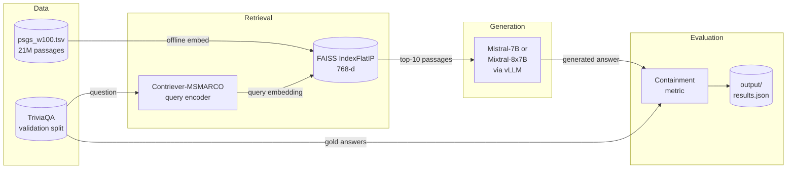

# Standard RAG Baseline

Reproduces the **Standard RAG** numbers from **Table 1** of
[Speculative RAG: Enhancing Retrieval Augmented Generation Through Drafting](../doc/speculative-rag-iclr2025.pdf)
(Wang et al., ICLR 2025).

| Model                 | TriviaQA (ours) | TriviaQA (paper) |
|-----------------------|:---------------:|:----------------:|
| Mistral-7B-Instruct   |   _run eval_    |      67.11       |
| Mixtral-8x7B-Instruct |   _run eval_    |      73.91       |

---

## What is Standard RAG?

**Standard RAG** is the simplest retrieval-augmented generation setup:

1. Embed the question and retrieve the **top-10 passages** from a FAISS vector store (Contriever-MSMARCO over the DPR Wikipedia corpus, 21M passages).
2. **Concatenate** all 10 passages into a single prompt using the `[INST]...[/INST]` format from Appendix I, Figure 8 of the paper.
3. Generate a short answer with **greedy decoding** (temperature = 0) via vLLM.
4. Score with the **containment metric**: correct if any gold answer alias appears (normalised) in the model response.

**Speculative RAG** replaces step 2–3 with parallel drafting over passage subsets and a verifier selection step, yielding ≥1.3× latency speedup at matched or better accuracy. Standard RAG is the baseline that makes that comparison concrete.

---

## Architecture



The pipeline runs as a **Vertex AI custom job**: a Docker container downloads or reuses a pre-built FAISS index from GCS, runs inference, and uploads `output/results.json` back to GCS.

---

## Prerequisites

| Tool       | Install                                                              |
|------------|----------------------------------------------------------------------|
| uv         | `curl -LsSf https://astral.sh/uv/install.sh \| sh`                  |
| Docker     | [docker.com](https://docker.com) — Desktop or Engine                 |
| Terraform  | [developer.hashicorp.com/terraform](https://developer.hashicorp.com/terraform/install) |
| gcloud CLI | [cloud.google.com/sdk](https://cloud.google.com/sdk/docs/install)   |

**GCP requirements:**
- A GCP project with billing enabled

**HuggingFace requirements:**
- A HuggingFace account — sign up at [huggingface.co](https://huggingface.co)
- Access to `mistralai/Mistral-7B-Instruct-v0.1` — request at [huggingface.co/mistralai/Mistral-7B-Instruct-v0.1](https://huggingface.co/mistralai/Mistral-7B-Instruct-v0.1) (approval is usually instant)
- A read-only access token — create one at **Settings → Access Tokens → New token** (select *Read* scope)

---

## Step 1 — GCP setup

```bash
# Authenticate
gcloud auth login
gcloud auth application-default login
gcloud config set project YOUR_PROJECT_ID

# Enable required APIs (only needed once)
make gcp-enable-apis
```

`make gcp-enable-apis` enables: Vertex AI, Artifact Registry, Secret Manager, and Cloud Storage APIs. **Wait ~60 seconds after running before proceeding.**

---

## Step 2 — Request GPU quota

New GCP projects have **zero GPU quota** by default. You must request an increase before submitting jobs.

1. Go to: **Console → IAM & Admin → Quotas & System Limits**
   Direct link: `https://console.cloud.google.com/iam-admin/quotas`
2. Filter by **Service** = `Vertex AI API`
3. Find and select `custom_model_training_nvidia_a100_gpus` for `us-central1`
4. Click **Edit Quotas** and request **1**
5. Also request `custom_model_training_nvidia_l4_gpus` (24 GB, backup option)

**Why A100?** Mistral-7B fp16 weights alone are ~14 GB. A T4 (16 GB) leaves only ~2 GB for KV cache and activations, which causes OOM during inference. An A100 (40 GB) or L4 (24 GB) has sufficient headroom.

**Justification text** (copy-paste into the request form):
> Reproducing ML research results (Speculative RAG, ICLR 2025). Need to run Mistral-7B-Instruct-v0.1 in fp16 (~14 GB). Requesting 1 A100 for a one-time batch inference job.

Approvals are typically instant or within a few hours for small requests (1–4 GPUs).

---

## Step 3 — Configure .env

```bash
cp .env.example .env
```

Edit `.env`:

```dotenv
GCP_PROJECT_ID=your-project-id        # gcloud config get project
GCP_REGION=us-central1
PROJECT_NAME=standard-rag
GCS_BUCKET=your-bucket-name           # set after make infra-apply (Step 4)
HF_TOKEN=hf_xxxx                      # huggingface.co → Settings → Access Tokens (Read scope)
```

---

## Step 4 — Provision GCP infrastructure

```bash
make infra-init
make infra-apply
```

Terraform creates:
- **GCS bucket** — stores the FAISS index and `results.json`
- **Artifact Registry repository** — stores the Docker image
- **Service account** (`triviaqa-rag-vertex@...`) with roles:
  `storage.objectAdmin`, `logging.logWriter`, `artifactregistry.reader`

After apply, copy the bucket name from the Terraform output and set it in `.env`:

```bash
# Get the bucket name
terraform -chdir=infra output

# Then update .env:
GCS_BUCKET=<bucket name from output>
```

---

## Step 5 — Build and push the Docker image

```bash
make docker-push
```

This builds a `linux/amd64` image based on `vllm/vllm-openai:v0.4.3` (CUDA 12.1 + PyTorch + vLLM pre-installed) and pushes it to Artifact Registry. The first build takes ~10 minutes due to the large base image; subsequent builds use the layer cache.

---

## Step 6 — Run on Vertex AI

### Smoke test (ENV=dev — recommended first)

```bash
make vertex-submit          # defaults to ENV=dev
make vertex-logs            # stream logs
make fetch-results          # download results.json and print table
```

`ENV=dev` runs against a **100k-passage subset** of the index and evaluates **500 TriviaQA examples**. The job takes ~15 minutes on an A100 and costs <$0.50.

On first run, the container builds the subset index from scratch and caches it in GCS. Subsequent runs skip the build and download from GCS directly (~2 minutes startup).

### Full evaluation (ENV=prod)

Before running the full eval, clear the cached index so the container rebuilds at full scale:

```bash
make clear-index-cache
make vertex-submit ENV=prod
make vertex-logs
make fetch-results
```

`make clear-index-cache` removes the 100k-passage index from GCS. The container checks GCS on startup and reuses whatever index is cached there — if you skip this step, the full eval will run against the 100k-passage subset index instead of the full 21M-passage one.

`ENV=prod` builds the full **21M-passage** index (2–3 hours on the first run, cached on GCS for all subsequent runs) and evaluates the full TriviaQA validation split (11,313 examples). Total runtime: ~4–5 hours. Target accuracy: **67.11%** for Mistral-7B.

### Monitoring

```bash
make vertex-status          # show recent job statuses
make vertex-logs            # stream logs from most recent job
```

Or view in the GCP console: **Vertex AI → Training → Custom Jobs**.

---

## Local development (macOS)

The pipeline is developed locally on macOS (CPU only) for everything except generation:

```bash
make setup          # uv sync --all-extras
make test           # pytest (FAISS tests skipped on macOS ARM)
make lint
make fmt
```

`torch` and `vllm` are macOS-excluded from the dependencies (`sys_platform != 'linux'`); vLLM only runs on Linux+CUDA. The retrieval, evaluation, and data loading code can be tested locally with small fixtures.

---

## Project structure

```
standard-rag/
├── Makefile                      # all targets: setup, test, docker-push, vertex-*
├── pyproject.toml                # uv-managed deps (torch/vllm excluded on macOS)
├── Dockerfile                    # vllm/vllm-openai:v0.4.3 base + our package
├── .env.example
├── output/                           # results written here (gitignored)
│   └── results.json
├── infra/
│   ├── main.tf                   # GCS bucket, Artifact Registry, service account
│   ├── variables.tf
│   └── vertex_job.yaml.tpl       # Vertex AI CustomJob spec (envsubst template)
├── scripts/
│   ├── run_pipeline.sh           # container entrypoint: download index → eval → upload
│   ├── download_data.sh          # downloads psgs_w100.tsv + pre-warms TriviaQA cache
│   └── build_index.sh            # embeds passages with Contriever, writes FAISS index
└── src/rag/
    ├── data/
    │   ├── loader.py             # load_dataset("trivia_qa", "rc.wikipedia")
    │   └── preprocess.py         # answer normalisation + containment metric
    ├── retrieval/
    │   ├── retriever.py          # Contriever-MSMARCO mean-pool + L2-norm encoder
    │   └── index.py              # FAISS IndexFlatIP: build / load / search
    ├── generation/
    │   ├── vllm_server.py        # vLLM offline batch inference (greedy, temp=0)
    │   └── prompts.py            # [INST]…[/INST] template (Appendix I Figure 8)
    ├── evaluation/
    │   └── metrics.py            # EvalResult with containment accuracy
    └── pipeline.py               # end-to-end eval loop + Typer CLI
```

---

## Prompt template

From **Appendix I, Figure 8** of the paper:

```
[INST] Given the following documents, answer the question.
Documents:
[1] <passage 1 title>
<passage 1 text>

[2] <passage 2 title>
<passage 2 text>
...

Question: <question> [/INST]
```

---

## Makefile reference

Run `make help` to see all available targets with descriptions.

---

## Cost estimates (Vertex AI)

| Phase                       | Machine              | Duration  | Approx. cost |
|-----------------------------|----------------------|-----------|--------------|
| Smoke test (ENV=dev)        | A100 × 1            | ~15 min   | ~$0.40       |
| Index build — full 21M      | A100 × 1            | ~2–3 hr   | ~$6–9        |
| Mistral-7B eval — full      | A100 × 1            | ~1–2 hr   | ~$3–6        |
| Mixtral-8x7B eval — full    | A100 × 4            | ~1–2 hr   | ~$12–24      |
| GCS storage (index + data)  | Standard             | ongoing   | ~$1–2/mo     |

A100 on Vertex AI is ~$3.67/hr (on-demand, us-central1). Vertex AI custom jobs shut down automatically when complete — no idle cost.

---

## Known differences from the paper

1. **Passage corpus**: DPR `psgs_w100.tsv` (21M passages, ~100 words each), Wikipedia 2018-12-20 snapshot. Matches the corpus cited by Self-RAG and Contriever. Minor preprocessing differences from the paper's internal setup are possible.
2. **Retriever**: `facebook/contriever-msmarco` — exact match to the paper.
3. **Evaluation split**: TriviaQA test labels are withheld; we use the `validation` split (11,313 examples). The paper also reports on validation.
4. **Decoding**: Greedy (temperature=0) as stated in the paper.
5. **GPU**: The paper likely used A100s. T4 (16 GB) cannot run Mistral-7B fp16 reliably; this pipeline targets A100 (40 GB) or L4 (24 GB).

---

## References

- Wang et al., *Speculative RAG: Enhancing Retrieval Augmented Generation Through Drafting*, ICLR 2025. ([paper PDF](../doc/speculative-rag-iclr2025.pdf))
